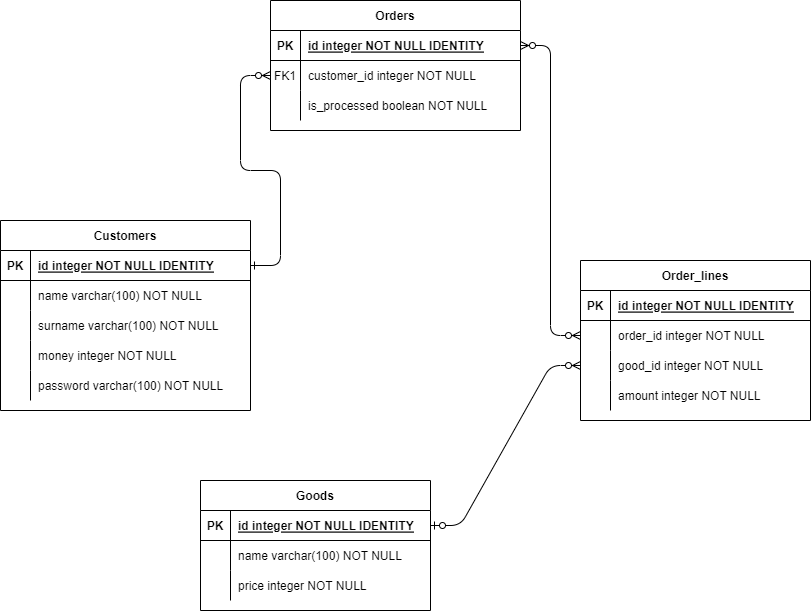

# Веб-приложение, реализующее функционал небольшого онлайн-магазина
## Цель
Задачей было написано веб приложение с DAO уровнем на чистом JDBC с тестирванием
с использованием In-memory database (H2). Приложение было написано при помощи Spring Boot, основной 
базой данных является PostgreSQL.

## Функционал
На данный момент в приложении реализован функционал регистрации новых пользователей, авторизации
и составления/оформления заказов. Товары добавляются напрямую в базу данных. В дальнейшем
планируется добавить пользователя Admin с возможностью добавления новых товаров и просмотра
статистики по товарам/пользователем через Web-интерфейс.

## Архитектура приложения
Приложение состоит из 4х основных сущностей:

Код проекта разбит на 3 основных пакета, dao (работа с бд), domain (бизнес логика) и 
ui (контроллеры). Приложение запускается из пакета ui из-за чего в @ComponentScan из
@SpringBootApplication были явно переданы пакеты dao и domain.
Веб-интерфейс реализован на чистом HTML, каждое действие пользователя отправляет на сервер
новый запрос и возвращает новую HTML-страницу.

## Тестирование
Тестирование было реализовано при помощи JUnit5, на данный момент написаны тесты
только для dao-уровня. Для тестирования создается собственный контекст, DAOTestContextConfiguration.
Соединение с базой данных устанавливаетс я классами, реализующими интерфейс ConnectionFactory, 
такие классы создаются как бины спринга и передаются в dao-классы. Приложение работыет с базой данных
PostgreSQL, а для тестирвоания используется база данных H2, для каждой из этих баз данных
написана собственная реализация ConnectionFactory, и при тестирование в dao-классы передается
из тестового контекста реализация для H2, а при работе из основного контекста реализация для
PostgreSQL. \
Написанные тесты запускаются автоматически при push'е изменений (добавено workflow для GitHub Actions).

